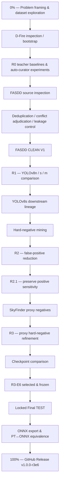
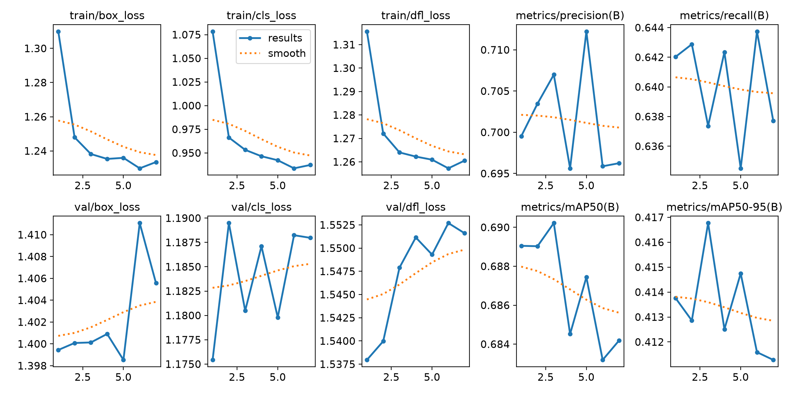
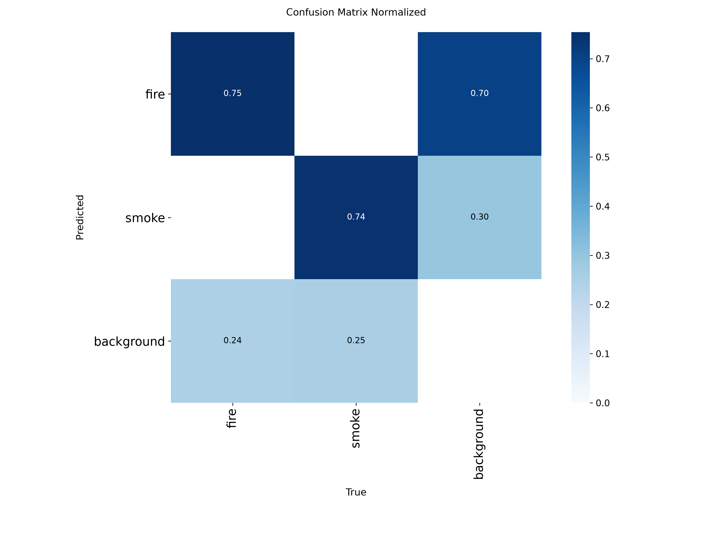

# 🔥 Fire & Smoke Detection — R3-E6

> End-to-end research and model-development archive for a YOLOv8 fire/smoke detector: dataset exploration, data cleaning, architecture comparison, hard-negative mining, checkpoint selection, locked final testing, and deployment export.

[](./docs/FINAL_MODEL_CARD.md)
[](./docs/FINAL_MODEL_CARD.md)
[](./docs/FINAL_MODEL_CARD.md)
[](./results/final_test/FINAL_TEST_SUMMARY.txt)
[](https://github.com/Supakorn289/fire-smoke-detection-r3e6/releases/tag/v1.0.0-r3e6)
[](https://doi.org/10.5281/zenodo.22954656)

## What this repository shows

This repository is not only a `best.pt` dump. It preserves the engineering path from early dataset experiments to a frozen, downloadable model release.

**Main work demonstrated**

- dataset inspection, curation, duplicate removal, and leakage control;
- D-Fire bootstrap / early R0 experiments;
- FASDD CLEAN V1 construction;
- YOLOv8n / YOLOv8s / YOLOv8m architecture comparison;
- hard-negative mining and manual review;
- R2 and R2.1 model refinement;
- SkyFinder proxy-negative mining;
- R3 checkpoint trade-off analysis;
- pre-TEST model freeze;
- one-time locked final TEST;
- PyTorch → ONNX export and equivalence verification;
- CPU benchmark and release packaging.

## Download the final model

The final model binaries are distributed through **GitHub Releases**, not committed into Git history.

| Artifact | Format | Size | SHA256 |
|---|---|---:|---|
| `fire_smoke_r3_e6_final.pt` | PyTorch / Ultralytics | ~85.35 MiB | `49dc0464d99a6c250cf3c3e305d4149c3d4ce3ee354d9d7a5ae1cb8c53a22183` |
| `fire_smoke_r3_e6_final_768_fp32.onnx` | ONNX FP32, opset 17 | ~42.71 MiB | `e887a759bcc65c89803c8ea0aa3d8891bcb0e60a5fd334433b2d6d912ba3bc79` |

**Release:** [v1.0.0-r3e6](https://github.com/Supakorn289/fire-smoke-detection-r3e6/releases/tag/v1.0.0-r3e6)

Reference inference contract:

- architecture: `YOLOv8s`
- classes: `0=Fire`, `1=Smoke`
- image size: `768`
- confidence: `0.25`
- NMS IoU: `0.70`
- `max_det=300`
- batch size: `1`

## Headline results

### Locked Final TEST

| Metric | All | Fire | Smoke |
|---|---:|---:|---:|
| Precision | **0.8109** | 0.8068 | 0.8150 |
| Recall | **0.7364** | 0.7815 | 0.6914 |
| mAP50 | **0.8044** | 0.8473 | 0.7615 |
| mAP50-95 | **0.5256** | 0.5382 | 0.5130 |

Final TEST composition:

- `15,863` images
- `9,005` Fire GT boxes
- `8,208` Smoke GT boxes
- `6,525` negative images

Derived overall F1 from the reported precision/recall: approximately **0.7719**.

> The Final TEST was opened only after checkpoint selection and model freeze. It was not reused for tuning, checkpoint selection, ONNX equivalence testing, or deployment optimization.

### R3 false-alert trade-off

At confidence `0.25`, the held-out internet-proxy negative image FPR changed from approximately:

- R2.1 baseline: `0.2685`
- selected R3-E6: `0.1502`

Relative reduction: approximately **44%**.

## Development history — 0 → 100%



Detailed history: [`docs/PROJECT_HISTORY.md`](./docs/PROJECT_HISTORY.md)

## Datasets and external sources

| Source | Role in this project | Final lineage? |
|---|---|---|
| **D-Fire** | Early inspection, bootstrap and R0 experimentation | Historical / pre-R1 |
| **FASDD_CV** | Main Fire/Smoke dataset; cleaning, R1→R3 lineage, locked Final TEST | **Yes** |
| **SkyFinder** | Internet proxy-negative pool used for false-alert mining and R3 refinement | **Negative-only auxiliary source** |

Dataset provenance, project-specific counts, and upstream citations are documented in [`docs/DATASETS.md`](./docs/DATASETS.md).

**Raw third-party datasets are not redistributed in this repository.**

## Visual training artifacts

### R3 training

<p align="center">
  
  
</p>

### R1 architecture experiments

Training curves and confusion matrices for YOLOv8n, YOLOv8s, and YOLOv8m are stored under [`results/r1/`](./results/r1/).

## Repository map

```text
.
├── README.md
├── configs/
│   ├── bootstrap_r0/
│   ├── r1/
│   ├── r2/
│   ├── r21/
│   └── r3/
├── docs/
│   ├── DATASETS.md
│   ├── FINAL_MODEL_CARD.md
│   ├── MODEL_SELECTION.md
│   ├── PROJECT_HISTORY.md
│   ├── REPRODUCIBILITY.md
│   └── TRAINING_PIPELINE.md
├── metadata/
├── model/
├── results/
│   ├── bootstrap_r0/
│   ├── r1/
│   ├── r2/
│   ├── r21/
│   ├── r3/
│   ├── final_test/
│   └── deployment/
└── scripts/
    ├── bootstrap_r0/
    ├── dataset_curation/
    ├── r1/
    ├── hard_negative/
    ├── r2/
    ├── r21/
    ├── r3/
    ├── final_evaluation/
    └── deployment/
```

## Reproducibility and auditability

Machine-specific filesystem paths were sanitized before publication. Metrics, hashes, model-selection records, and final-test results were not altered by path sanitization.

See:

- [`docs/REPRODUCIBILITY.md`](./docs/REPRODUCIBILITY.md)
- [`metadata/PATH_SANITIZATION.md`](./metadata/PATH_SANITIZATION.md)
- [`model/SHA256SUMS.txt`](./model/SHA256SUMS.txt)

## Important limitations

- Small smoke remains the most difficult size category.
- Single-frame negative-image false alerts remain non-zero.
- Fixed-confidence recall and Ultralytics standard recall use different evaluation protocols and should not be mixed.
- Temporal confirmation belongs to the end-to-end system layer and must be evaluated separately from the closed image-level Final TEST.

## Documentation

- [Research summary](./docs/RESEARCH_SUMMARY.md)
- [Project history: 0 → 100%](./docs/PROJECT_HISTORY.md)
- [Datasets and citations](./docs/DATASETS.md)
- [Training pipeline](./docs/TRAINING_PIPELINE.md)
- [Model selection](./docs/MODEL_SELECTION.md)
- [Final model card](./docs/FINAL_MODEL_CARD.md)
- [Reproducibility](./docs/REPRODUCIBILITY.md)
- [Third-party notices](./THIRD_PARTY_NOTICES.md)

## Third-party data and licensing

Third-party datasets remain the property of their respective authors and are not bundled in this repository. Users should obtain datasets from upstream sources and comply with the corresponding terms and citation requirements.

A repository-wide source-code license has not been declared in this snapshot.

## Citation

If you use this repository, trained model, experimental artifacts, or results in academic work, please cite:

> Supakorn Prammano. *Fire & Smoke Detection R3-E6*. Version 1.0.1. Zenodo, 2026. DOI: [10.5281/zenodo.22954656](https://doi.org/10.5281/zenodo.22954656)

Persistent identifier:

`10.5281/zenodo.22954656`

Zenodo record: https://doi.org/10.5281/zenodo.22954656

GitHub also provides citation metadata through [`CITATION.cff`](./CITATION.cff).
